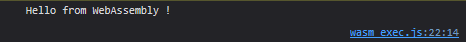
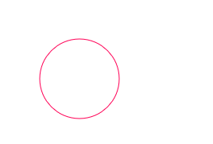
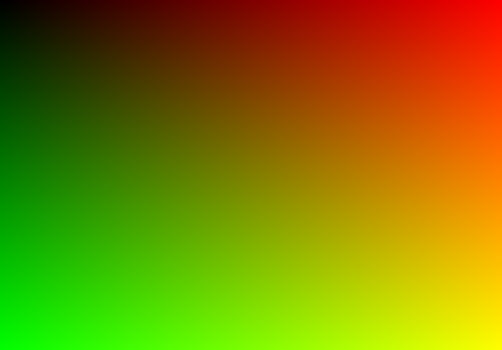

# The idea

HTML5 offers the ability to draw images from code with the [&lt;canvas&gt; element](https://developer.mozilla.org/en-US/docs/Web/HTML/Element/canvas) controlled directly from the browser, in Javascript. In this article, we will explore a way to leverage WebAssembly to achieve the same with Golang.

# WebAssembly boilerplate

Go ships with all necessary boilerplate code to quickly get up and running. We will start with the following `index.html`:

```html
<!-- index.html -->
<html>
  <head>
    <script src="wasm_exec.js"></script>
    <script>
      const go = new Go();
      WebAssembly.instantiateStreaming(fetch("app.wasm"), go.importObject).then((result) => {
          go.run(result.instance);
      });
    </script>
  </head>
  <body></body>
</html>
```

This index fetches the file `app.wasm` on start and executes it. It also references `wasm_exec.js` which ships with Go, found by default on `/usr/local/go/misc/wasm/wasm_exec.js` on Linux. Note this file has to match with the Go version you will use to compile the Wasm file !

The Wasm file itself is compiled from Go code. We will use the following file to start:

```go
package main

import (
	"fmt"
)

func main() {
	fmt.Println("Hello from WebAssembly !")
}
```

This basic Go file can be compiled to WebAssembly with this command:

```bash
GOOS=js GOARCH=wasm go build -o app.wasm
```

Now that all building blocks are in place, we can compile the Go source and setup all resulting files in a Web server. When accessing index.html we can see the following message in the console, generated from WebAssembly: 



# Accessing the canvas

In order to draw from Wasm, we first have to add a canvas to our HTML page. 

```html
<canvas id="canvas">HTML5 canvas is not supported on this browser</canvas>
```

The interface between Go code and the DOM is managed with the package [syscall/js](https://pkg.go.dev/syscall/js). Here are a few equivalents we can use from Javascript to Go: 

## Access a global object


### Javascript
```javascript
document
```

### Go
```go
jsDoc := js.Global().Get("document")
if !jsDoc.Truthy() {
  panic("Failed to get document")
}
```


The resulting object is of type `js.Value` and has a few methods to mimic the behaviour of a standard Javascript object.

## Call a function on a Javascript object


### Javascript
```javascript
result = object.function(args)
```

### Go
```go
result := object.Call("function", args)
if !result.Truthy() {
  panic("Failed to get result from object.function")
}
```


## Access a property from a Javascript object


### Javascript
```javascript
result = object.prop
```

### Go
```go
result := object.Get("prop")
if !result.Truthy() {
  panic("Failed to get property object.prop")
}
```


Other available methods are `Set`, `SetIndex`, and more... Refer to the package documentation for the full list. If you are using Visual Studio Code to write your Go code (you should !) then gopls may raise a warning as you try to import package `syscall/js` on a non-wasm build environment. Since we will in fact cross-compile our code with `GOOS=js GOARCH=wasm` we cann tell VS Code that this is our target platform by adding this to `.vscode/settings.json`: 

```json
{
  "go.toolsEnvVars": {
    "GOOS": "js",
    "GOARCH": "wasm"
  }
}
```

We can use the following Go code to access the Canvas context and use it to draw on the screen:

```go
package main

import (
	"fmt"
	"log"
	"math"
	"syscall/js"
)

func main() {
	jsDoc := js.Global().Get("document")
	if !jsDoc.Truthy() {
		log.Fatal("Failed to initialize DOM document")
	}

	canvas := jsDoc.Call("getElementById", "canvas")
	if !canvas.Truthy() {
		log.Fatal("Failed to initialize DOM canvas")
	}

	ctx = canvas.Call("getContext", "2d")
	if !ctx.Truthy() {
		log.Fatal("Failed to initialize canvas context")
	}

	rect := canvas.Call("getBoundingClientRect")
	if !rect.Truthy() {
		log.Fatal("Failed to initialize canvas bounding rect")
	}

	log.Printf("Canvas has size %dx%d", rect.Get("width").Int(), rect.Get("height").Int())

	canvas.Set("width", rect.Get("width").Int())
	canvas.Set("height", rect.Get("height").Int())

	sizeX = rect.Get("width").Int()
	sizeY = rect.Get("height").Int()

	ctx.Set("strokeStyle", "#FF0055")
	ctx.Call("beginPath")
	ctx.Call("arc", 100, 100, 50, 0, 2*math.Pi)
	ctx.Call("stroke")
}
```

Once compiled to WebAssembly, this program draws a pink circle on the canvas: 


 
# Drawing pixels

Now that we have access to the canvas, we can try to calculate pixel data directly from Go instead of using the Javascript drawing primitives, to take full advantage of the WebAssembly speed. The first naive implementation is to call `fillRect` to draw a one-by-one rect with the desired color on each pixel :

```go
for y := 0; y < sizeY; y++ {
  for x := 0; x < sizeX; x++ {
    ctx.Set("fillStyle", fmt.Sprintf("#%02x%02x00", int(float64(x)/float64(sizeX)*255), int(float64(y)/float64(sizeY)*255)))
    ctx.Call("fillRect", x, y, 1, 1)
  }
}
```

This code works, and after a few seconds we can see a beautiful gradient on our screen ! 



It works, but... It is still very slow. The reason is that we make two calls to the js interface for every pixel on the canvas, which is consuming lots of resources. An optimization of this code would be to calculate all pixel data at once, and only then calling the js interface with the full pixel data. This can be achieved with [canvas imageData](https://developer.mozilla.org/en-US/docs/Web/API/Canvas_API/Tutorial/Pixel_manipulation_with_canvas#the_imagedata_object):

```go
imgDataHolder := ctx.Call("getImageData", 0, 0, sizeX, sizeY)
if !imgDataHolder.Truthy() {
  log.Fatal("Failed to get canvas image data holder")
}

imgData := imgDataHolder.Get("data")
if !imgData.Truthy() {
  log.Fatal("Failed to get canvas image data")
}
imgDataW := imgDataHolder.Get("width")
if !imgData.Truthy() {
  log.Fatal("Failed to get canvas image data width")
}
sizeX := imgDataW.Int()
imgDataH := imgDataHolder.Get("height")
if !imgData.Truthy() {
  log.Fatal("Failed to get canvas image data height")
}
sizeY := imgDataH.Int()

for y := 0; y < sizeY; y++ {
  for x := 0; x < sizeX; x++ {
    imgData.SetIndex((y*sizeX+x)*4, uint8(float64(x)/float64(sizeX)*255))
    imgData.SetIndex((y*sizeX+x)*4+1, uint8(float64(y)/float64(sizeY)*255))
    imgData.SetIndex((y*sizeX+x)*4+2, 0)
    imgData.SetIndex((y*sizeX+x)*4+3, 0xff)
  }
}

ctx.Call("putImageData", imgDataHolder, 0, 0)
```

This result is way more efficient, and this time we see the same gradient in less than a second !

# Next steps 

We can use this codebase to draw anything on the screen, as long as we are able to calculate pixel data from Go code !