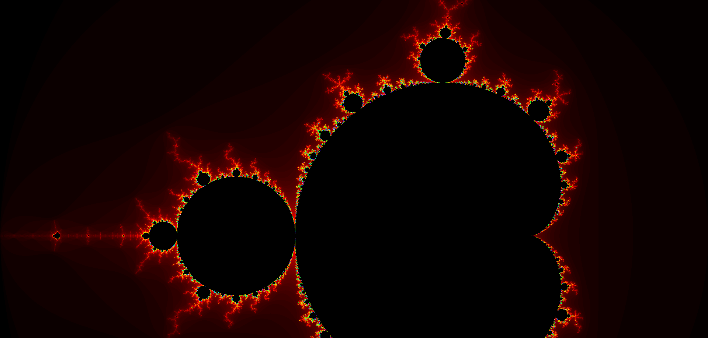

## Live demo

[--> View the live demo here ! <--](/mandelgo/)

## Background

I started the project [Mandelgo](https://github.com/Salicorne/Mandelgo) back in 2021 as a personal exercise, the goal was to use the implementation of Go's complex numbers to compute and draw the Mandelbrot fractal in a GTK context. Almost four years later, I decided to revisit this project to develop a WebAssembly visualization, following principles explored in the [previous post]() hosted as [Mandelgo-web](https://github.com/Salicorne/Mandelgo-web). 

## What is done, and ideas for next steps

I already implemented, like in the GTK app, the ability to zoom on click. Interesting leads for next steps could be to allow to de-zoom, display the current zoom level, show a loading icon, render chunk by chunk (my understanding is that the current WebAssembly implementation for Go is not multi-threaded, even though [this could change in the future](https://github.com/golang/go/issues/28631)), allow customizing the pallet (this is already allowed by Mandelgo, but not yet by Mandelgo-web), and many more... 

